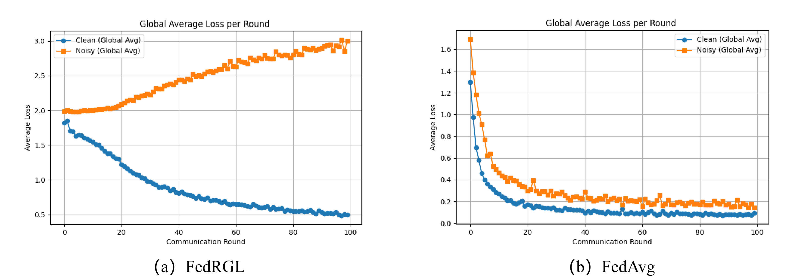

**Tab. A.** CADF filtering accuracy on CS at round 50 under different noise rates.

<table>
  <tr>
    <th>CS</th>
    <th colspan="10">Client Index</th>
  </tr>
  <tr>
    <th>Noise rate</th>
    <th>1</th><th>2</th><th>3</th><th>4</th><th>5</th>
    <th>6</th><th>7</th><th>8</th><th>9</th><th>10</th>
  </tr>
  <tr>
    <td>0.1</td>
    <td>0.927</td><td>0.936</td><td>0.919</td><td>0.903</td><td>0.916</td>
    <td>0.925</td><td>0.933</td><td>0.917</td><td>0.907</td><td>0.898</td>
  </tr>
  <tr>
    <td>0.3</td>
    <td>0.910</td><td>0.903</td><td>0.911</td><td>0.886</td><td>0.898</td>
    <td>0.912</td><td>0.924</td><td>0.893</td><td>0.895</td><td>0.873</td>
  </tr>
  <tr>
    <td>0.5</td>
    <td>0.902</td><td>0.897</td><td>0.905</td><td>0.881</td><td>0.889</td>
    <td>0.894</td><td>0.909</td><td>0.886</td><td>0.877</td><td>0.862</td>
  </tr>
</table>

**Figure A.** Average losses of clean and noisy nodes during training on Cora under 0.5 noise.
