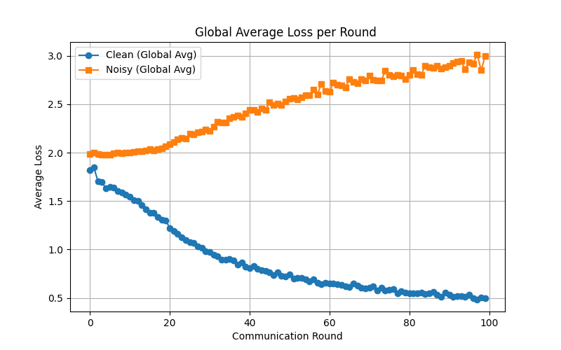
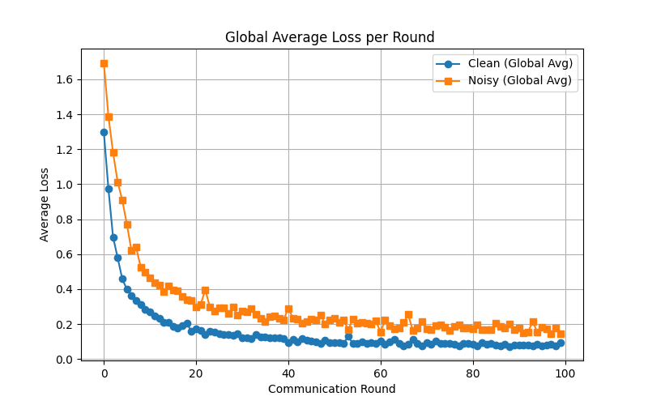

  
  

  <b>(a) FedRGL &nbsp;&nbsp;&nbsp;&nbsp;&nbsp;&nbsp;&nbsp;&nbsp;&nbsp;&nbsp; (b) FedAvg</b>

  <b>Figure A. Average losses of clean and noisy nodes during training on Cora under 0.5 noise.</b>

